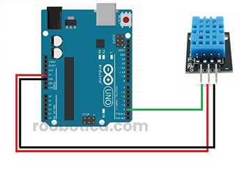

# Práctica de Arduino: Medición de Temperatura y Humedad con el Sensor DHT11/DHT22

## 1. Título de la Práctica
Medición de Temperatura y Humedad con el Sensor DHT11/DHT22

## 2. Objetivo
Los alumnos se familiarizarán con el sensor DHT11/DHT22 realizando actividades prácticas para medir la temperatura y la humedad. Además, se evaluará la precisión del sensor mediante la toma de múltiples lecturas y el cálculo de promedios. El objetivo es que los estudiantes comprendan cómo integrar sensores ambientales en sistemas embebidos y aplicaciones de IoT.

## 3. Materiales y Herramientas
- **Componentes físicos:**
  - Arduino UNO o similar.
  - Sensor DHT11 o DHT22.
  - Protoboard.
  - Cables de conexión.
- **Software:**
  - Arduino IDE.
  - Monitor Serial para visualizar resultados.
  - Librería DHT: [Descarga](https://github.com/adafruit/DHT-sensor-library).

## 4. Introducción Teórica
El DHT11 y el DHT22 son sensores que miden tanto la temperatura como la humedad ambiental. El DHT22 es más preciso y tiene un rango de medición mayor que el DHT11, pero ambos funcionan de manera similar en términos de uso con Arduino.

**Características del DHT11:**
- Rango de Temperatura: 0-50 °C, precisión ±2 °C.
- Rango de Humedad: 20-90%, precisión ±5%.

**Características del DHT22:**
- Rango de Temperatura: -40-80 °C, precisión ±0.5 °C.
- Rango de Humedad: 0-100%, precisión ±2-5%.

Estos sensores son ampliamente usados en sistemas IoT para controlar ambientes, en proyectos de domótica, invernaderos, y estaciones meteorológicas.

## 5. Diagrama de Conexiones
- **Conexión del DHT11/DHT22:**
  - VCC → 5V en Arduino.
  - GND → GND en Arduino.
  - DATA → Pin digital 2 en Arduino.

## 6. Actividades Prácticas

### Actividad 1: Medición Básica de Temperatura y Humedad
En esta actividad inicial, los estudiantes medirán la temperatura y la humedad del entorno utilizando el sensor.

#### Instrucciones:
1. Conecta el sensor según el diagrama.
2. Carga el código de medición básica del sensor desde [`codigo_dht_medicion_basica.ino`](Codigo/codigo_dht_medicion_basica.ino).
3. Observa las lecturas de temperatura y humedad en el Monitor Serial.

#### Preguntas de Análisis:
- ¿Qué valores de temperatura y humedad obtienes?
- ¿Existen fluctuaciones notables en las lecturas?

### Actividad 2: Promedio de Múltiples Lecturas
En esta actividad, los estudiantes tomarán múltiples lecturas de temperatura y humedad, calculando el promedio para evaluar la estabilidad y precisión del sensor.

#### Instrucciones:
1. Carga el código de promedio de lecturas desde [`codigo_dht_promedio.ino`](Codigo/codigo_dht_promedio.ino).
2. El código tomará 10 lecturas consecutivas y mostrará el promedio de la temperatura y la humedad.
3. Analiza los resultados obtenidos.

#### Preguntas de Análisis:
- ¿Cuál es el promedio de temperatura y humedad después de las múltiples lecturas?
- ¿Qué tan estables son las lecturas del sensor en un intervalo de tiempo?

### Actividad 3: Evaluación en Diferentes Condiciones
En esta actividad, los estudiantes moverán el sensor a diferentes entornos (por ejemplo, una zona más caliente o más húmeda) y analizarán cómo cambian las lecturas del sensor.

#### Instrucciones:
1. Carga nuevamente el código de medición básica desde [`codigo_dht_medicion_basica.ino`](Codigo/codigo_dht_medicion_basica.ino).
2. Coloca el sensor en un entorno con temperatura y humedad diferentes (por ejemplo, en una habitación cerrada, cerca de una ventana, o en el exterior).
3. Observa cómo varían las lecturas.

#### Preguntas de Análisis:
- ¿Cómo cambian las lecturas cuando mueves el sensor a un ambiente diferente?
- ¿Cuánto tiempo tarda el sensor en adaptarse a las nuevas condiciones?

## 7. Análisis de Resultados
Los estudiantes deben analizar los resultados obtenidos en cada actividad y reflexionar sobre el desempeño del sensor DHT11/DHT22 en diferentes situaciones.

- ¿Qué factores afectan la precisión de las lecturas de temperatura y humedad?
- ¿Cómo se comporta el sensor cuando hay fluctuaciones rápidas de temperatura o humedad?
- ¿Cómo aplicarías este sensor en un sistema IoT, como un invernadero o estación meteorológica?

## 8. Preguntas de Reflexión o Evaluación
1. ¿Qué aprendiste sobre el comportamiento del sensor en diferentes condiciones ambientales?
2. ¿Cómo podrías mejorar la precisión del sistema en un entorno de IoT?
3. ¿Qué factores podrían interferir con las mediciones del sensor en un entorno real?

## 9. Bibliografía y Recursos
- [Librería DHT11/DHT22 de Adafruit](https://github.com/adafruit/DHT-sensor-library)
- [Documentación oficial de Arduino](https://www.arduino.cc/reference/en/)
