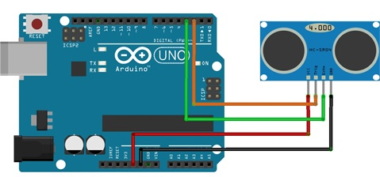

# Práctica de Arduino: Caracterización del Sensor de Proximidad HC-SR04

## 1. Título de la Práctica
Caracterización y Uso del Sensor de Proximidad Ultrasónico HC-SR04

## 2. Objetivo
Los alumnos se familiarizarán con el sensor HC-SR04 realizando actividades prácticas de caracterización para entender su comportamiento en diferentes escenarios. El objetivo es medir la precisión, repetibilidad y tiempo de respuesta del sensor en aplicaciones típicas de IoT. Los alumnos aprenderán a configurar el sensor, tomar lecturas precisas de distancia y analizar los resultados en diversos contextos.

## 3. Materiales y Herramientas
- **Componentes físicos:**
  - Arduino UNO o similar.
  - Sensor ultrasónico HC-SR04.
  - Protoboard.
  - Cables de conexión.
  - Objetos para medir (superficies de diferentes materiales: metal, madera, plástico).
  - Cinta métrica o regla.
- **Software:**
  - Arduino IDE.
  - Monitor Serial para visualizar resultados.
  - Librería estándar (no se necesita una librería específica para este sensor).

## 4. Introducción Teórica
El sensor HC-SR04 mide distancias mediante el uso de ondas ultrasónicas. El sensor envía un pulso de sonido y mide el tiempo que tarda en rebotar desde un objeto hasta regresar al sensor. A partir de este tiempo se puede calcular la distancia al objeto.

**Características del HC-SR04:**
- Voltaje de operación: 5V.
- Rango de medición: 2 cm a 400 cm.
- Precisión: ±3 mm.

El uso de sensores ultrasónicos es común en aplicaciones IoT para monitorear distancias en tiempo real, evitar obstáculos o medir niveles en sistemas automatizados.

## 5. Diagrama de Conexiones
- **Conexión del HC-SR04:**
  - VCC → 5V en Arduino.
  - GND → GND en Arduino.
  - TRIG → Pin digital 2 en Arduino.
  - ECHO → Pin digital 3 en Arduino.

## 6. Actividades Prácticas

### Actividad 1: Medición Básica de Distancia
En esta actividad inicial, los estudiantes medirán la distancia de un objeto estático a diferentes distancias. Esta actividad permitirá a los estudiantes confirmar el funcionamiento básico del sensor.

#### Instrucciones:
1. Conecta el sensor según el diagrama.
2. Carga el código de medición básica del sensor desde [`codigo_medicion_basica.ino`](Codigo/codigo_medicion_basica.ino).
3. Coloca un objeto a diferentes distancias (10 cm, 50 cm, 100 cm) y registra las lecturas del Monitor Serial.
4. Compara las lecturas obtenidas con las medidas reales.

#### Preguntas de Análisis:
- ¿Qué precisión observas en las lecturas?
- ¿Existen diferencias significativas entre las distancias reales y las medidas por el sensor?

### Actividad 2: Evaluación de la Repetibilidad
En esta actividad, los estudiantes tomarán varias mediciones de un mismo objeto a la misma distancia para evaluar la repetibilidad del sensor.

#### Instrucciones:
1. Carga el código de repetibilidad desde [`codigo_repetibilidad.ino`](Codigo/codigo_repetibilidad.ino).
2. Coloca un objeto a una distancia fija (por ejemplo, 50 cm) y toma 20 mediciones consecutivas.
3. Registra los resultados e identifica si existe variabilidad entre las mediciones.

#### Preguntas de Análisis:
- ¿Qué tan consistente es el sensor al medir la misma distancia repetidamente?
- ¿Cuántas veces el sensor midió exactamente la misma distancia?

### Actividad 3: Medición de Distancias con Diferentes Materiales
El material del objeto puede afectar las lecturas del sensor ultrasónico. En esta actividad, los estudiantes medirán la distancia a objetos de diferentes materiales (madera, metal, plástico) y analizarán los resultados.

#### Instrucciones:
1. Carga el código de medición básica desde [`codigo_medicion_basica.ino`](Codigo/codigo_medicion_basica.ino).
2. Coloca un objeto de cada material a una distancia fija (por ejemplo, 30 cm).
3. Registra las mediciones para cada material.

#### Preguntas de Análisis:
- ¿Las lecturas son diferentes para cada material?
- ¿Qué material refleja mejor las ondas ultrasónicas y por qué crees que ocurre esto?

### Actividad 4: Evaluación del Tiempo de Respuesta
Esta actividad evalúa el tiempo que tarda el sensor en detectar un cambio en la distancia de un objeto que se mueve hacia o lejos del sensor.

#### Instrucciones:
1. Carga el código de tiempo de respuesta desde [`codigo_tiempo_respuesta.ino`](Codigo/codigo_tiempo_respuesta.ino).
2. Mueve un objeto hacia el sensor desde 100 cm hasta 20 cm de manera constante y registra cómo varían las lecturas.
3. Analiza cuán rápido el sensor responde a los cambios de distancia.

#### Preguntas de Análisis:
- ¿Qué tan rápido detecta el sensor los cambios en la posición del objeto?
- ¿Cómo afecta la velocidad de movimiento del objeto a la respuesta del sensor?

### Actividad 5: Limitaciones del Sensor
En esta actividad, los estudiantes identificarán las limitaciones del sensor al intentar medir objetos más allá de su rango o en condiciones subóptimas (por ejemplo, superficies irregulares).

#### Instrucciones:
1. Carga el código de medición básica desde [`codigo_medicion_basica.ino`](Codigo/codigo_medicion_basica.ino).
2. Intenta medir objetos a más de 400 cm y observa las lecturas.
3. Coloca superficies irregulares o de formas complejas frente al sensor y analiza los resultados.

#### Preguntas de Análisis:
- ¿Qué ocurre cuando el objeto está fuera del rango de medición del sensor?
- ¿Qué tipos de objetos son más difíciles de medir con precisión?

## 7. **Análisis de Resultados**
Los estudiantes deben analizar los resultados obtenidos en cada actividad y reflexionar sobre el desempeño del sensor HC-SR04 en diferentes situaciones.

- ¿Qué factores afectan la precisión del sensor?
- ¿Cómo varía la repetibilidad dependiendo de la superficie del objeto?
- ¿Cómo aplicarías este sensor en un sistema IoT basado en la información que recopilaste?

## 8. **Preguntas de Reflexión o Evaluación**
1. ¿Qué aprendiste sobre el comportamiento del sensor en diferentes situaciones?
2. ¿Cómo podrías mejorar la precisión o el tiempo de respuesta del sensor en un sistema real?
3. ¿Qué tipos de aplicaciones prácticas crees que podrían beneficiarse del uso de este sensor en un contexto de IoT?

## 9. **Bibliografía y Recursos**
- [naylampmechatronics - Tutorial HC-SR04](https://naylampmechatronics.com/blog/10_tutorial-de-arduino-y-sensor-ultrasonico-hc-sr04.html)
- [Documentación oficial de Arduino](https://docs.arduino.cc/libraries/hcsr04-ultrasonic-sensor/)
