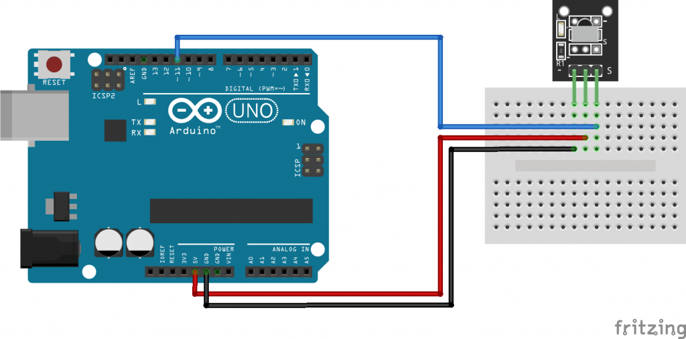

# Práctica de Arduino: Recepción y Emisión de Señales Infrarrojas con el KY-022

## 1. Título de la Práctica
Recepción y Emisión de Señales Infrarrojas con el Sensor KY-022

## 2. Objetivo
Los alumnos se familiarizarán con el uso del receptor infrarrojo KY-022 para captar y decodificar señales de un control remoto. Además, aprenderán a utilizar un osciloscopio para visualizar las señales recibidas y replicar las mismas señales utilizando un emisor infrarrojo. Los estudiantes podrán capturar y analizar códigos IR para luego grabarlos y retransmitirlos.

## 3. Materiales y Herramientas
- **Componentes físicos:**
  - Arduino UNO o similar.
  - Sensor receptor infrarrojo KY-022.
  - Emisor infrarrojo.
  - Control remoto.
  - Protoboard.
  - Cables de conexión.
- **Software:**
  - Arduino IDE.
  - Monitor Serial para visualizar resultados.
  - Librería IRremote (para manejar señales infrarrojas).
- **Herramientas adicionales:**
  - Osciloscopio (para observar las señales infrarrojas).

## 4. Introducción Teórica
El **KY-022** es un receptor infrarrojo que permite captar señales emitidas por un control remoto y decodificarlas en Arduino. La señal capturada puede visualizarse como un código hexadecimal, lo que permite replicar la señal usando un emisor infrarrojo.

El uso de osciloscopios es fundamental para observar la forma de onda de las señales infrarrojas y entender mejor su estructura temporal y la codificación. Los sistemas que utilizan infrarrojos, como controles remotos, emplean distintos protocolos, siendo uno de los más comunes el **NEC**.

## 5. Diagrama de Conexiones
- **Conexión del KY-022:**
  - Pin **S** del KY-022 → Pin digital 11 en Arduino.
  - Pin **GND** → GND en Arduino.
  - Pin **VCC** → 5V en Arduino.

- **Conexión del Emisor IR:**
  - Anodo del emisor → Pin digital 3 en Arduino.
  - Cátodo del emisor → GND en Arduino.

## 6. Actividades Prácticas

### Actividad 1: Recepción de Señales Infrarrojas
En esta actividad, los estudiantes usarán el receptor infrarrojo KY-022 para captar las señales emitidas por un control remoto.

#### Instrucciones:
1. Conecta el receptor infrarrojo KY-022 según el diagrama.
2. Carga el código de recepción de señales desde [`codigo_ky022_recepcion.ino`](Codigo/codigo_ky022_recepcion.ino).
3. Utiliza un control remoto para enviar señales al receptor y observa los códigos capturados en el Monitor Serial.

#### Preguntas de Análisis:
- ¿Qué códigos se capturan con cada botón del control remoto?
- ¿Son consistentes las señales capturadas al presionar el mismo botón varias veces?

### Actividad 2: Uso de Osciloscopio para Visualizar las Señales Infrarrojas
En esta actividad, los estudiantes utilizarán un osciloscopio para observar la forma de onda de las señales capturadas por el KY-022.

#### Instrucciones:
1. Conecta la salida del receptor infrarrojo al osciloscopio para observar las señales.
2. Presiona diferentes botones del control remoto y analiza la forma de onda generada.
3. Observa las características temporales de las señales (duración, frecuencia de pulso).

#### Preguntas de Análisis:
- ¿Cómo es la forma de onda de las señales infrarrojas?
- ¿Qué diferencias se observan entre los distintos botones del control remoto?

### Actividad 3: Grabación y Emisión de Señales Infrarrojas
En esta actividad, los estudiantes grabarán las señales recibidas por el KY-022 y las replicarán usando un emisor infrarrojo.

#### Instrucciones:
1. Utiliza el código de recepción para capturar una señal infrarroja.
2. Anota el código hexadecimal recibido.
3. Carga el código de emisión de señales desde [`codigo_ky022_emision.ino`](Codigo/codigo_ky022_emision.ino), reemplazando el valor hexadecimal capturado con el código correspondiente.
4. Observa cómo el emisor infrarrojo replica la señal capturada.

#### Preguntas de Análisis:
- ¿Se replica correctamente la señal grabada?
- ¿Qué aplicaciones prácticas se te ocurren para la replicación de señales infrarrojas?

## 7. Análisis de Resultados
Los estudiantes deben analizar los resultados obtenidos en cada actividad, comprendiendo la relación entre las señales infrarrojas capturadas, su visualización en el osciloscopio, y la replicación de las mismas.

- ¿Qué factores afectan la captura precisa de las señales infrarrojas?
- ¿Cómo podrías utilizar este sistema en aplicaciones IoT, como sistemas de automatización controlados por infrarrojos?

## 8. Preguntas de Reflexión o Evaluación
1. ¿Qué aprendiste sobre la estructura de las señales infrarrojas?
2. ¿Cómo podrías mejorar la captura y replicación de señales en un sistema real?
3. ¿Qué aplicaciones prácticas crees que podrían beneficiarse del uso de señales infrarrojas en un contexto de IoT?

## 9. Bibliografía y Recursos
- [Librería IRremote de Arduino](https://github.com/Arduino-IRremote/Arduino-IRremote)
- [Documentación oficial de Arduino](https://www.arduino.cc/reference/en/)
