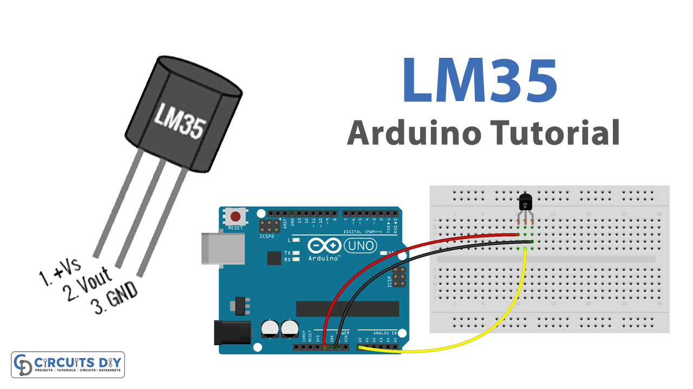

# Práctica de Arduino: Medición de Temperatura con el Sensor LM35

## 1. Título de la Práctica
Medición de Temperatura con el Sensor LM35

## 2. Objetivo
Familiarizar a los estudiantes con el uso del sensor LM35 para medir la temperatura ambiente en grados Celsius. Los estudiantes realizarán mediciones básicas de temperatura, calcularán promedios de múltiples lecturas y evaluarán el comportamiento del sensor en diferentes condiciones ambientales. Esta práctica les permitirá comprender cómo integrar sensores de temperatura en sistemas embebidos y aplicaciones de IoT.

## 3. Materiales y Herramientas
- **Componentes físicos:**
  - Arduino UNO o similar.
  - Sensor LM35.
  - Protoboard.
  - Cables de conexión.
- **Software:**
  - Arduino IDE.
  - Monitor Serial para visualizar resultados.

## 4. Introducción Teórica
El LM35 es un sensor de temperatura de precisión que mide la temperatura en grados Celsius. Genera una salida de voltaje lineal que es proporcional a la temperatura. Por cada grado Celsius, el sensor produce 10 mV.

**Características del LM35:**
- Rango de medición: -55 °C a 150 °C.
- Precisión: ±0.5 °C a temperatura ambiente.

Este tipo de sensor es común en aplicaciones IoT que requieren la medición de temperatura, como termostatos, estaciones meteorológicas, y sistemas de control ambiental.

## 5. Diagrama de Conexiones
- **Conexión del LM35:**
  - VCC (pata 1) → 5V en Arduino.
  - GND (pata 3) → GND en Arduino.
  - OUT (pata 2) → Pin analógico A0 en Arduino.

## 6. Actividades Prácticas

### Actividad 1: Medición Básica de Temperatura
En esta actividad, los estudiantes medirán la temperatura ambiente usando el sensor LM35 y observarán cómo varían las lecturas dependiendo de las condiciones ambientales.

#### Instrucciones:
1. Conecta el sensor según el diagrama.
2. Carga el código de medición básica del sensor desde [`codigo_lm35_medicion_basica.ino`](Codigo/codigo_lm35_medicion_basica.ino).
3. Observa las lecturas del sensor en el Monitor Serial.

#### Preguntas de Análisis:
- ¿Qué valores de temperatura obtienes en diferentes entornos?
- ¿Cómo varían las lecturas al mover el sensor a un ambiente más cálido o más frío?

### Actividad 2: Promedio de Múltiples Lecturas de Temperatura
En esta actividad, los estudiantes realizarán múltiples lecturas consecutivas de la temperatura, calculando un promedio para obtener una medición más precisa y estable.

#### Instrucciones:
1. Carga el código de promedio de lecturas desde [`codigo_lm35_promedio.ino`](Codigo/codigo_lm35_promedio.ino).
2. El código tomará 10 lecturas consecutivas y calculará el promedio de las mismas.
3. Observa los resultados y analiza cómo varían en diferentes condiciones ambientales.

#### Preguntas de Análisis:
- ¿Cuál es el promedio de las lecturas en condiciones constantes?
- ¿Qué tan estables son las lecturas cuando la temperatura se mantiene constante?

### Actividad 3: Evaluación en Diferentes Condiciones de Temperatura
Los estudiantes colocarán el sensor en diferentes entornos, tanto cálidos como fríos, para observar cómo varían las lecturas de temperatura.

#### Instrucciones:
1. Carga nuevamente el código de medición básica desde [`codigo_lm35_medicion_basica.ino`](Codigo/codigo_lm35_medicion_basica.ino).
2. Coloca el sensor en un ambiente más cálido o más frío (por ejemplo, cerca de una fuente de calor o en una nevera).
3. Observa cómo varían las lecturas.

#### Preguntas de Análisis:
- ¿Cómo varían las lecturas en diferentes entornos?
- ¿Qué tan rápido responde el sensor a cambios bruscos de temperatura?

## 7. Análisis de Resultados
Los estudiantes deben analizar los resultados obtenidos en cada actividad y reflexionar sobre el comportamiento del sensor LM35 en diferentes situaciones ambientales.

- ¿Qué factores afectan la precisión de las lecturas de temperatura?

## 8. Preguntas de Reflexión o Evaluación
1. ¿Qué aprendiste sobre el comportamiento del sensor LM35 en diferentes condiciones de temperatura?
2. ¿Cómo podrías mejorar la precisión del sistema en un entorno de IoT?
3. ¿Qué aplicaciones prácticas crees que podrían beneficiarse del uso de este sensor en un contexto de IoT?

## 9. Bibliografía y Recursos
- [Documentación oficial de Arduino](https://www.arduino.cc/reference/en/)
