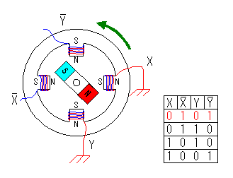
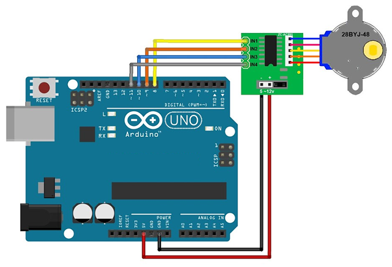

# Práctica de Arduino: Control de un Motor a Pasos con el Driver ULN2003

## 1. Título de la Práctica
Control de un Motor a Pasos con el Driver ULN2003 utilizando Arduino

## 2. Objetivo
Familiarizar a los estudiantes con el funcionamiento de un motor a pasos controlado por el driver ULN2003 y Arduino. Los estudiantes aprenderán a controlar la rotación del motor, ajustar su velocidad y dirección de giro.

## 3. Materiales y Herramientas
- **Componentes físicos:**
  - Arduino UNO o similar.
  - Motor a pasos 28BYJ-48.
  - Driver ULN2003.
  - Protoboard.
  - Cables de conexión.
- **Software:**
  - Arduino IDE.
  - Librería Stepper.

## 4. Introducción Teórica

### ¿Qué es un Motor a Pasos?
Un **motor a pasos** es un tipo de motor eléctrico que se mueve en pasos discretos. A diferencia de los motores convencionales que giran de manera continua, los motores a pasos dividen la rotación completa en un número específico de pasos. Cada pulso eléctrico que recibe el motor provoca un "paso", lo que permite controlar la posición del motor con gran precisión. Este tipo de motor se utiliza ampliamente en aplicaciones que requieren control exacto de movimiento, como en impresoras 3D, máquinas CNC, y robótica.

### Funcionamiento de los Motores a Pasos
El motor a pasos se compone de varios devanados que, cuando se energizan en un orden específico, provocan que el rotor gire. Existen dos tipos principales de motores a pasos:

- **Motor a pasos de imán permanente**: Utiliza un rotor con un imán permanente.
- **Motor a pasos de reluctancia variable**: Tiene un rotor hecho de un material ferromagnético.

El motor 28BYJ-48 utilizado en esta práctica es un motor a pasos unipolar de 5 fases. Al aplicar la secuencia correcta de señales a los bobinados del motor, el rotor se moverá paso a paso.

### Driver ULN2003
El **ULN2003** es un controlador que permite controlar un motor a pasos conectando sus salidas a las bobinas del motor. Este driver contiene transistores Darlington que permiten manejar corrientes más altas y proteger los circuitos de control.

### Ventajas del Motor a Pasos
- **Posicionamiento preciso**: El motor a pasos se mueve una cantidad fija de grados por cada paso, lo que permite control preciso de la rotación.
- **Control de velocidad**: Puedes ajustar la velocidad del motor a pasos variando la frecuencia de los pulsos.
- **Control de dirección**: Invirtiendo la secuencia de señales, puedes cambiar la dirección de rotación del motor.

## 5. Diagrama de Conexiones
- **Conexión del Motor a Pasos y el ULN2003:**
  - IN1 del ULN2003 → Pin digital 8 en Arduino.
  - IN2 del ULN2003 → Pin digital 9 en Arduino.
  - IN3 del ULN2003 → Pin digital 10 en Arduino.
  - IN4 del ULN2003 → Pin digital 11 en Arduino.
  - GND del ULN2003 → GND en Arduino.
  - VCC del ULN2003 → 5V en Arduino.

## 6. Actividades Prácticas

### Actividad 1: Rotación Básica del Motor
En esta actividad, los estudiantes harán que el motor a pasos gire en ambas direcciones utilizando Arduino.

#### Instrucciones:
1. Conecta el motor y el driver ULN2003 según el diagrama.
2. Carga el código básico de control del motor desde `codigo_motor_basico.ino`.
3. Observa cómo el motor realiza una rotación completa en ambas direcciones.

#### Preguntas de Análisis:
- ¿Cuántos pasos se necesitan para una rotación completa?
- ¿Qué ocurre si reduces el número de pasos?

### Actividad 2: Ajuste de la Velocidad del Motor
En esta actividad, los estudiantes ajustarán la velocidad de rotación del motor a pasos.

#### Instrucciones:
1. Carga el código de control de velocidad desde `codigo_motor_velocidad.ino`.
2. Ajusta la velocidad cambiando el valor de los retrasos (delays) en el código.

#### Preguntas de Análisis:
- ¿Qué sucede cuando aumentas o disminuyes el retraso entre pasos?
- ¿Cómo podrías aplicar este control de velocidad en una aplicación práctica?

### Actividad 3: Control de la Dirección del Motor
En esta actividad, los estudiantes cambiarán la dirección de giro del motor utilizando comandos desde el Monitor Serial.

#### Instrucciones:
1. Carga el código para controlar la dirección del motor desde `codigo_motor_direccion.ino`.
2. Envía los comandos "HORA" o "ANTI" para controlar la dirección.

#### Preguntas de Análisis:
- ¿Qué ventajas tiene poder controlar la dirección de rotación en tiempo real?
- ¿Cómo podrías utilizar este control en aplicaciones robóticas?

## 7. Análisis de Resultados
Los estudiantes deben analizar los resultados obtenidos en cada actividad, comprendiendo cómo interactuar con un motor a pasos para controlar su rotación, velocidad y dirección.

- ¿Cómo afecta el número de pasos a la precisión del movimiento del motor?
- ¿Qué factores determinan la velocidad máxima de un motor a pasos?

## 8. Preguntas de Reflexión o Evaluación
- ¿Qué aprendiste sobre el funcionamiento de un motor a pasos?
- ¿Cómo podrías aplicar el control de velocidad y dirección en un proyecto de automatización?
- ¿Qué ventajas y limitaciones tiene el motor a pasos frente a otros tipos de motores?

## 9. Bibliografía y Recursos

- [Tutorial](https://robots-argentina.com.ar/didactica/arduino-motor-paso-a-paso-28byj-48-y-modulo-uln2003/) 
- [Info Stepper Motor](http://www.piclist.com/images/www/hobby_elec/e_step1.htm) 