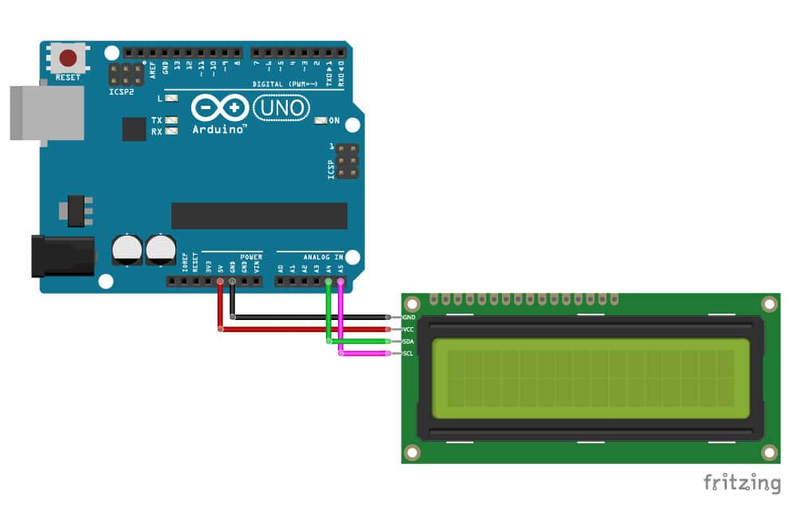

# Práctica de Arduino: Uso de una Pantalla LCD

## 1. Título de la Práctica
Uso de una Pantalla LCD con Arduino

## 2. Objetivo
Familiarizar a los estudiantes con el uso de una pantalla LCD (16x2) para mostrar información desde una placa Arduino. Los estudiantes aprenderán a mostrar texto en la pantalla, controlar la retroiluminación y desplazar texto.

## 3. Materiales y Herramientas
- **Componentes físicos:**
  - Arduino UNO o similar.
  - Pantalla LCD 16x2 con interfaz I2C.
  - Protoboard.
  - Cables de conexión.
- **Software:**
  - Arduino IDE.
  - Librería LiquidCrystal_I2C.

## 4. Introducción Teórica
Las pantallas LCD (Liquid Crystal Display) se utilizan comúnmente en proyectos de Arduino para mostrar información en tiempo real. Las pantallas LCD 16x2 permiten mostrar 16 caracteres por línea en dos líneas. En esta práctica, se utilizará una pantalla LCD con comunicación I2C, que facilita la conexión y el control utilizando solo 4 pines.

## 5. Diagrama de Conexiones
- **Conexión de la pantalla LCD con Arduino a través de I2C:**
  - VCC → 5V en Arduino.
  - GND → GND en Arduino.
  - SDA → Pin A4 en Arduino.
  - SCL → Pin A5 en Arduino.

## 6. Actividades Prácticas

### Actividad 1: Mostrar Texto en la Pantalla
En esta actividad, los estudiantes mostrarán un mensaje de texto en la pantalla LCD.

#### Instrucciones:
1. Conecta la pantalla LCD según el diagrama.
2. Carga el código para mostrar texto desde [`codigo_lcd_texto.ino`](Codigo/codigo_lcd_texto.ino).
3. Observa cómo se muestra el texto "Hola, Mundo" en la pantalla.

#### Preguntas de Análisis:
- ¿Cuántos caracteres puedes mostrar en cada línea?
- ¿Qué ocurre si intentas mostrar más de 16 caracteres por línea?

### Actividad 2: Desplazar Texto en la Pantalla
En esta actividad, los estudiantes desplazarán el texto mostrado en la pantalla LCD.

#### Instrucciones:
1. Carga el código de desplazamiento de texto desde [`codigo_lcd_desplazamiento.ino`](Codigo/codigo_lcd_desplazamiento.ino).
2. Observa cómo el texto se desplaza de izquierda a derecha en la pantalla.

#### Preguntas de Análisis:
- ¿Qué ocurre si cambias la dirección de desplazamiento?
- ¿Cómo podrías utilizar el desplazamiento de texto en una aplicación práctica?

## 7. Análisis de Resultados
Los estudiantes deben analizar los resultados obtenidos en cada actividad, comprendiendo cómo interactuar con la pantalla LCD para mostrar información, controlar la retroiluminación y desplazar texto.

- ¿Qué aplicaciones prácticas puedes desarrollar utilizando una pantalla LCD?
- ¿Qué ventajas ofrece una pantalla LCD en proyectos de IoT o sistemas embebidos?

## 8. Preguntas de Reflexión o Evaluación
1. ¿Qué aprendiste sobre el uso de una pantalla LCD con Arduino?
2. ¿Cómo podrías optimizar el uso de la pantalla en proyectos que requieren bajo consumo de energía?
3. ¿Qué otras aplicaciones podrías desarrollar con pantallas LCD en proyectos de IoT?

## 9. Bibliografía y Recursos
- [Librería LiquidCrystal_I2C para Arduino](https://github.com/johnrickman/LiquidCrystal_I2C)
- [Documentación oficial de Arduino](https://www.arduino.cc/reference/en/)
